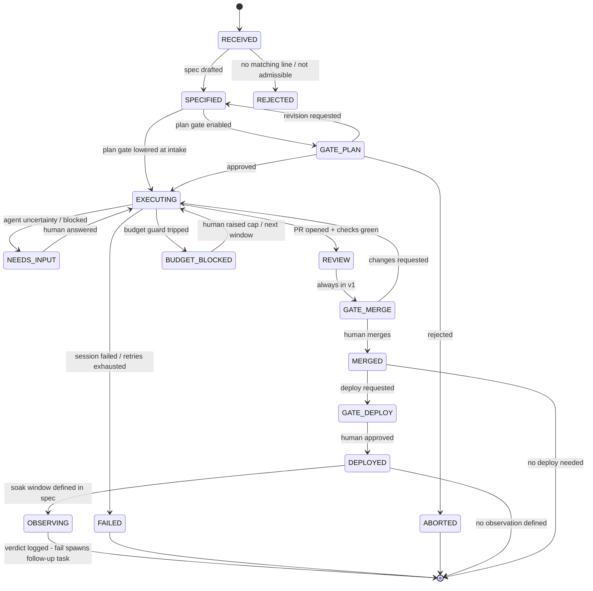

# darkfactory — Architecture (governance core)

> Status: DESIGN, updated after spikes #1/#1b/#2 (2026-07-19). The old `[SPIKE]`
> markers are resolved inline (*italic notes*); what remains open is listed under
> "Open questions". Everything else is engine-agnostic by design: it survives a change
> of orchestrator (Hermes) or executor (Claude Code).

## 1. System overview

darkfactory is a **thin governance layer** between a human and two borrowed engines.
It owns exactly four things: the **task state machine**, the **gate engine**, the
**budget guard**, and the **trace store**. Everything else is delegated.

```
Human ── Telegram ──> Intake adapter ──> Orchestrator (Hermes)
                                              │
                                              ▼
                                     Factory core (this repo)
                                     ├─ Registry (per-line config)
                                     ├─ Task state machine
                                     ├─ Gate engine
                                     ├─ Budget guard
                                     └─ Trace store
                                              │
                                              ▼
                                     Executor: Claude Code (headless)
                                     in ephemeral Docker container
                                              │
                                              ▼
                                     GitHub (branch, PR, checks)
```

Design rule (from CLAUDE.md): if a component here starts duplicating an agent loop,
a scheduler, a channel, or a UI that Hermes / Claude Code / GitHub already provides,
the design is wrong.

**Terminology** — a **line** (FR: *ligne de montage*, assembly line) is one governed
project under the factory: one GitHub repo + one registry entry. v1 has a single
line: kaos-fleet-manager. A **task** is one unit of work on one line.

## 2. Task lifecycle (state machine)

A **task** is the unit of work: one intake request, one branch, one PR, one trace.



State invariants:

- Every transition emits a trace event (see §6). No silent transitions.
- `EXECUTING` is the only state where a container exists. Container lifetime ==
  time spent in `EXECUTING` (+ retries). Leaving the state for any reason kills
  the container. **This kill is darkfactory's job, not Hermes'.** Spike #1b found
  Hermes runs task containers as `sleep infinity` and only reaps them on an idle
  timer (`~2 × lifetime_seconds`), reusing them across turns by label — so the
  factory core must `docker rm -f` the `hermes-task-id=<task>` container on leaving
  `EXECUTING`, and set `docker_persist_across_processes: false`, or the invariant is
  fiction (see `doc/spike-1b-findings.md` Finding 4).
- A task in `NEEDS_INPUT` or any `GATE_*` state consumes **zero** LLM budget.
- Terminal states are terminal. A "retry" of a failed task is a **new task**
  referencing the old trace — history is append-only, like kaos heat history.

## 3. Gates

A **gate** is a blocking checkpoint requiring explicit human action on Telegram.

| Gate | Default | Lowerable at intake? | Notes |
|---|---|---|---|
| `plan` | mandatory | yes | approve the task spec before any code is written |
| `merge` | mandatory | yes (post-v1 only) | v1: never lowered — the line hasn't earned it |
| `deploy` | mandatory | yes | only meaningful for lines with a deploy target |
| `db_schema` | mandatory | **never** | non-bypassable by construction |

Rules:

- **Gate config lives in the registry, never in the target repo.** A repo (or an
  agent working inside it, or injected content inside it) must not be able to edit
  its own governance. The factory core reads gates from the registry only.
- Lowering happens **at intake, per task**, by the human, explicitly
  (e.g. `"...— skip plan gate"`). The orchestrator never lowers a gate on its own.
- Gate timeout behavior: **pause, never proceed.** A gate with no answer holds the
  task indefinitely and re-pings at a configurable interval. Default-open gates are
  how autonomous systems bite.
- **Named trade-off — pause-forever vs fail-open, and why it is NOT symmetric.**
  Pause-forever buys safety at the cost of liveness: flaky infra (a dead notifier,
  a broken checker) halts the factory. The opposite choice is legitimate — but only
  for a certain *class* of gate. omniscient/dark-factory runs its code-review gate
  `fail_open` (reviewer error ⇒ advisory, never blocking) and that is sound: a
  code-review gate is an **automated check**, and a degraded check dropping to
  advisory still leaves a human deciding.

  Our gates are not checks. `plan`, `merge`, `deploy`, `db_schema` are **human
  authorization gates**. An authorization gate that fails open is not a gate — it
  is auto-approval with extra steps. **This does not become acceptable at higher
  concurrency**: a factory that merges unreviewed code because the notifier died is
  broken, not fast. The rule is categorical, not contextual:

  | Gate class | On infra failure |
  |---|---|
  | Automated check (lint, conformance, future reviewers) | may degrade to advisory (fail-open), human still decides |
  | Human authorization (`plan`, `merge`, `deploy`, `db_schema`) | **never** fail-open — pause, re-ping, escalate |

  What *may* be revisited as concurrency rises: the re-ping cadence, per-gate
  timeouts before escalation, and whether some future automated pre-check can
  reduce how often a human gate is hit. Never whether a human gate can be skipped.

### 3.1 Plan gate levels

The plan gate is graduated, not binary. Level is set per line in the registry,
overridable per task at intake:

- `quick` — one-line spec, human approves. For trivial, low-blast-radius tasks.
- `spec` (default) — orchestrator drafts a full spec, human approves or requests
  revision.
- `interview` — before drafting, the orchestrator interviews the human on the
  intake channel to extract the *goal* (the decision the work serves), not just
  the task. For fuzzy or high-stakes requests.

**Every spec, at any level, must contain a `verification` section**: measurable
acceptance criteria + external signal source where applicable (test suite, history
tables, deployment probe). Defined *before* execution — the executor cannot grade
its own homework against criteria it wrote after the fact. The merge gate presents
the PR **against these approved criteria**, turning review from vibes into a
contract check.

### 3.2 The db_schema gate (defense in depth)

Rationale: target projects may have no migration framework (kaos has no Alembic —
a bad schema change means a prod DB reset). Detection is layered because any single
layer can be fooled:

1. **Declaration**: the executor prompt requires the agent to declare
   `touches_schema: true` in its result payload when models/schema change.
2. **Diff scan**: the factory scans the PR diff against per-line watched paths
   declared in the registry (e.g. `backend/app/models/**`, `**/migrations/**`).
3. **Fail-closed**: declaration OR diff-scan hit ⇒ gate raised. The gate can only
   be *raised* automatically, never cleared automatically.

Residual risk (accepted, documented): an agent editing schema through a path not
watched and lying in its declaration. Mitigation is the mandatory merge gate in v1
— a human reads the diff anyway.

## 4. Escalation protocol (NEEDS_INPUT)

When the executor is uncertain on a structuring choice, it stops and escalates.
Escalation message format on the intake channel:

```
[df:task-0042] kaos-fleet-manager — NEEDS INPUT
Q: <one question, one decision>
Context: <≤5 lines, agent-written>
Options: (1) <default-safe> (2) <alternative> (3) abort (4) custom — free-text
No reply ⇒ task stays paused (re-ping in 12h).
```

Rules: one question per escalation; options must include a safe default, abort, and
**custom** (free-text human input). A custom answer may rechallenge the approved
spec — if it invalidates the plan, the task transitions back to `SPECIFIED` and
re-passes the plan gate rather than continuing on a stale plan; the executor never
silently reconciles a contradiction between the spec and a human answer.
The container is killed while waiting (state leaves `EXECUTING`) — resume spawns a
fresh container from the saved task context. *(Resolved, spike #1: the claude-code
skill exposes native session resume — `--resume <session_id>`, imposable
`--session-id`, `--fork-session` — so resume replays the session, not a full
context rebuild; the fresh container re-mounts the same task repo.)*

## 4b. Long-horizon validation (OBSERVING)

Some changes cannot be judged at merge time: their impact only shows after data
accumulates (kaos thermal inertia: minutes to hours; same pattern for any
metrics-driven change). Distinct from testing — golden/unit tests use simulated
time and belong in `EXECUTING`; OBSERVING validates **real-world impact
post-deploy**.

- Opt-in per task, defined in the spec's `verification` section: metric, data
  source, window, pass/fail criterion
  (e.g. "no high-rate trigger artifacts in `GroupHeatHistory` over 48h").
- Data source must be **structured and persistent** (kaos: the append-only history
  tables — ground truth per its CLAUDE.md), never volatile logs.
- Scheduling of the check uses the orchestrator's native scheduler (Hermes) — no
  custom cron. Zero LLM budget during the window; one short session at verdict
  time to read the data and report.
- Verdict is logged in the trace and reported on the intake channel. **Fail spawns
  a follow-up task** (append-only history, §2); it never auto-reverts a deploy.

Not needed for spike #3 (pure-logic golden tests). Required before any task that
changes thermal algo behavior.

## 5. Budget guard

Purpose: protect the **human's** weekly Claude sub caps from a looping factory
(a burned cap blocks the human's own work, not just the factory).

- Unit of accounting: **executor sessions started** (coarse but sub-compatible —
  token counts aren't visible on subscription usage). One retry = one session.
- Caps in registry: `per_line.daily`, `per_line.weekly`, `global.daily`,
  `global.weekly`. Global caps < sub cap with margin for human usage.
- On trip: task → `BUDGET_BLOCKED`, notification with counts, nothing auto-resumes
  until the human raises the cap or the window rolls. The guard can only block,
  never spend.
- **Window/cap exhaustion is an environment-level failure, never a task failure.**
  Observed at scale by omniscient/dark-factory#35: an exhausted shared session
  window makes *every* executor call fail instantly; treating those as per-task
  failures burns the retry budget of the whole in-flight set on guaranteed losses.
  Rule: on the exhaustion signature, pause **dispatch globally** + notify; do NOT
  consume the task's retry; resume when the window rolls. Known signature to
  detect: `result_is_error` + empty transcript + fast non-zero exit.
  *(Partially observed, spike #1b: a failed `claude -p` returns `is_error: true` +
  `subtype: error_*` + `result: null` + non-zero exit — capture must check exit code
  AND `subtype`, never `|| true`. The true window-exhaustion case still to be seen in
  the wild; route it to the environment-level pause, not a per-task failure.)*
- Per-task executor budget is enforceable natively: the claude-code skill exposes
  `--max-budget-usd` (spike #1) — set it per task from the registry cap so a runaway
  session self-terminates in-container rather than relying only on session counting.
- Orchestrator-side spend (Hermes loop) is **flat-rate**: *(resolved, spike #2: the
  OpenAI sub validated via Codex `gpt-5.6-terra`; the Claude-API-with-hard-cap
  fallback is not triggered.)*

## 6. Traces (observability, demo material)

Per task, under `data/traces/<task-id>/`:

- `events.jsonl` — every state transition:
  `{ts, task, from, to, actor: human|factory|executor, reason, refs}`
- `spec.md` — the approved task spec (what the plan gate approved).
- `session/` — executor session artifacts (stdout JSON, result payload).
  *(Known, spike #1/#1b: the `--output-format json` result carries `subtype`,
  `is_error`, `result`, `session_id`, `total_cost_usd`, and per-model `modelUsage` —
  captured intact through Hermes. Note `modelUsage` shows multiple models per session
  (sonnet + haiku): `total_cost_usd` is the unit, not "one session = one model".)*
- PR body links the task id; the trace links the PR. Bidirectional, auditable.

Traces are the raw material for the CV demo and the project journal. Format is
boring on purpose: JSONL + markdown, greppable, no dashboard required.

## 7. Trust boundaries & secrets

| Zone | Trust | Contents |
|---|---|---|
| Factory core + registry | trusted | gates, budgets, tokens config — factory repo only |
| Target repos | semi-trusted | code + CLAUDE.md; readable context, **not** governance |
| External content (issues, third-party docs, web) | untrusted | prompt-injection surface |

Secrets rules:

- **The executor (Claude Code session) runs entirely inside the task container**,
  never on the host. Rationale: if Claude Code ran on the host, its bash/write
  tools would execute on the host and the "task container" would be a fiction —
  the agent escapes the sandbox by construction. Hermes stays on the host: it
  orchestrates but never executes generated code. Consequence: the dev stack
  (claude, git, project deps) and the Claude auth live in the container.
  *(Verified, spike #1b: with `terminal.backend: docker` + a pinned task-runner
  image, `claude -p` runs in a container — no `venv`/pytest touches the host, unlike
  the `local` backend of spike #1. This is the whole reason spike #1b existed.)*
- Residual risk (accepted, mitigated): code the agent runs in-container can read
  the mounted OAuth credentials even read-only. Mitigations: short-lived
  containers + **egress restricted to an allowlist** (Anthropic, GitHub) so
  exfiltration has nowhere to go.
  - *Auth half — DONE (spike #1b):* the sub auth is a single file
    (`~/.claude/.credentials.json`) mounted **read-only** via `docker_volumes` to
    `/root/.claude/.credentials.json`; read-only was sufficient (see
    `doc/spike-1b-findings.md`). HOME=`/root` is tmpfs in disposable mode, so
    claude's cache/session/history die with the container.
  - *Egress half — DESIGNED, NOT yet stress-tested (spike #1b):* default container
    egress is **wide open** (verified — reaches arbitrary domains). Hermes has no
    built-in domain allowlist (network is all-or-nothing). Retained design: a Docker
    `--internal` network (verified to block *all* egress, no host root needed) + a
    dual-homed **domain-allowlist proxy** as the single controlled egress. **This
    gates the first unattended overnight run** — no autonomous run until the
    allowlist is stood up and tested.
- Task containers receive **only** the fine-grained GitHub token of their line's
  repo. Never the Telegram token, never other lines' tokens, never registry write
  access.
- Host (VPS): Tailscale-only, zero public inbound. Hermes runs on the host, task
  containers on the same host's Docker. Docker socket is **never** mounted into a
  container.

## 8. Registry (interface sketch — full schema is deliverable #2)

One directory per line: `registry/<line>/line.yaml` — repo, deploy target, gates,
budget caps, watched schema paths, context entrypoints (CLAUDE.md, INDEX.md).
Adding a line == adding a directory that passes the admissibility checklist
(deliverable #3). No core code change.

## 9. Failure modes (design-time answers)

| Failure | Behavior |
|---|---|
| Executor session crashes | retry once (fresh container, same spec), then `FAILED` + notify |
| Claude session window/cap exhausted | environment-level: global dispatch pause + notify; task retries **not** consumed; auto-resume when the window rolls (§5) |
| Claude auth expired | `FAILED` fast with explicit reason; notify — no blind retry loop |
| Checks red on PR | stays `EXECUTING` (agent iterates) until session budget for the task is spent, then `FAILED` |
| Gate never answered | paused forever, periodic re-ping; never auto-proceed |
| Orchestrator (Hermes) down | tasks freeze in place; state is on disk, resume on restart — factory core keeps no in-memory-only state |
| Injection detected / suspected in repo content | abort task, flag line, human review before the line runs again |

## 10. Explicitly out of scope (v1)

Custom web UI, OAuth2, voice, multi-line concurrency (one task at a time in v1 —
concurrency is a budget and review problem before a technical one), auto-merge,
plugin-level Hermes extensions, journal line.

## Open questions (blocked on spikes)

1. ~~Hermes ⇄ factory core boundary~~ **Resolved (spike #1):** the native
   `claude-code` skill drives `claude -p` via Hermes' terminal tool — that is the
   integration seam, no custom subprocess glue. The terminal backend (`docker`) is
   what containerizes it (spike #1b).
2. ~~Pause/resume cost of executor sessions~~ **Resolved (spike #1):** native session
   resume (`--resume`/`--session-id`/`--fork-session`), §4.
3. ~~Orchestration provider + its budget model~~ **Resolved (spike #2):** OpenAI sub
   via Codex, flat-rate, §5.

Still open after spikes #1/#1b/#2:

4. **Egress allowlist** — designed (`--internal` + domain-allowlist proxy), not yet
   stress-tested (§7). Gates the first unattended overnight run.
5. **Per-task container teardown** — Hermes doesn't do it; darkfactory's state machine
   must (§2, `doc/spike-1b-findings.md` Finding 4).
6. **In-container file ownership** (`root:root`) vs `docker_run_as_host_user` — decide
   before the task-runner does `git push` (spike #1b Finding 5).
